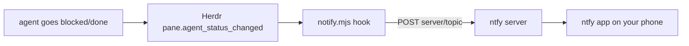

<p align="center">
  
</p>

# herdr-ntfy-notify

[](https://buymeacoffee.com/jjurasszek)

A [Herdr](https://herdr.dev) plugin that pushes a notification to your phone via [ntfy](https://ntfy.sh) the moment an agent goes **blocked** (waiting on you) or **done**.

## The problem

Long-running coding agents alternate between working and waiting on you. Herdr's sidebar shows that state, and its toast notifications cover you while you're at the machine - but the moment you step away, a blocked agent just sits there burning wall-clock until you happen to check.

**herdr-ntfy-notify** closes that loop: when any agent in Herdr goes `blocked` or `done`, your phone buzzes. Mosh/SSH in, unblock it, put the phone away.

## How it works

No daemon, no polling. Herdr fires the plugin's `pane.agent_status_changed` event hook on every agent status transition; the hook filters to `blocked`/`done` and publishes to your ntfy topic. The ntfy app on your phone subscribes to the same topic.



- `blocked` publishes at priority 4 with a `warning` tag; `done` at priority 3 with a checkmark.
- The message body is just `workspace - tab` context - keep it generic, see the security note below.
- Plain Node ESM, zero dependencies, Node >= 18. No build step.

## Install

```bash
herdr plugin install jjuraszek/herdr-ntfy-notify
```

Requires Herdr >= 0.7.0.

Or, for development, link a local checkout:

```bash
git clone https://github.com/jjuraszek/herdr-ntfy-notify
herdr plugin link ./herdr-ntfy-notify
```

## Configure

```bash
herdr plugin config-dir jjuraszek.ntfy-notify   # prints the config directory
```

Drop a `.env` there (see [.env.example](.env.example)):

```sh
NTFY_TOPIC=herdr-x9q2k7-your-unguessable-topic
```

Optional keys: `NTFY_SERVER` (default `https://ntfy.sh` - point at your self-hosted instance if you have one), `NTFY_TOKEN` (bearer token for servers with access control), `HERDR_NTFY_ENABLED` (default on/off).

On the phone: install the ntfy app ([iOS](https://apps.apple.com/app/ntfy/id1625396347) / [Android](https://play.google.com/store/apps/details?id=io.heckel.ntfy)) and subscribe to the same topic.

## Toggle

Herdr's command palette (`Ctrl+P`) -> "Toggle ntfy notify" flips notifications on/off without unlinking the plugin; while enabled, the terminal title shows `ntfy on`. You can also bind a prefix key:

```toml
[keybinds]
bindings = { "prefix+n" = "plugin:jjuraszek.ntfy-notify:toggle" }
```

## Security note

On the public `ntfy.sh` server, the topic name is the only secret: anyone who knows it can subscribe and publish. Use a long, unguessable topic, keep message bodies generic (this plugin only sends `workspace - tab` and the status in the title), and consider self-hosting ntfy or enabling access tokens if the metadata is sensitive.

## Credits

Adapted from the official [agent-telegram-notify](https://github.com/ogulcancelik/herdr-plugin-examples/tree/main/agent-telegram-notify) cookbook example, with the Telegram transport swapped for ntfy.

## License

[MIT](LICENSE)
