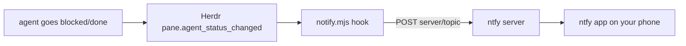

<p align="center">
  
</p>

# herdr-ntfy-notify

[](https://buymeacoffee.com/jjurasszek)

A [Herdr](https://herdr.dev) plugin that pushes a notification to your phone via [ntfy](https://ntfy.sh) the moment an agent goes **blocked** (waiting on you) or **done**.

## The problem

Long-running coding agents alternate between working and waiting on you. Herdr's sidebar shows that state, and its toast notifications cover you while you're at the machine - but the moment you step away, a blocked agent just sits there burning wall-clock until you happen to check.

**herdr-ntfy-notify** closes that loop: when any agent in Herdr goes `blocked` or `done`, your phone buzzes. Mosh/SSH in, unblock it, put the phone away.

## How it works

No daemon, no polling. Herdr fires the plugin's `pane.agent_status_changed` event hook on every agent status transition; the hook filters to `blocked`/`done` and publishes to your ntfy topic. The ntfy app on your phone subscribes to the same topic.



- `blocked` publishes at priority 4 with a `warning` tag; `done` at priority 3 with a checkmark.
- The message body is just `workspace - tab` context - keep it generic, see the security note below.
- Plain Node ESM, zero dependencies, Node >= 18. No build step.
- The hook exits 0 on every failure path (missing `NTFY_TOPIC`, malformed event, unreachable server, 5 s timeout) so it never blocks Herdr.

### When it fires

Herdr's agent states, as they reach this plugin:

| Status | Meaning | Push? |
|---|---|---|
| `blocked` | Herdr recognized an approval or question UI - the agent is waiting on you | yes, priority 4 |
| `done` | the agent finished a turn in a pane you have not viewed since | yes, priority 3 |
| `idle` | finished, and you were looking at the pane (or have focused it since) | no |
| `working` / `unknown` | still running / unclassified | no |

So sitting at the desk with the agent's pane focused produces no pushes; walking away and letting it finish does. For accurate `working`/`blocked` on agents with lifecycle hooks (Pi, OMP, OpenCode, ...) install the Herdr integration first - `herdr integration install pi`, `herdr integration status` - otherwise Herdr classifies from the screen and may report `idle` where you would expect `blocked` (see [Agents](https://herdr.dev/docs/agents/)).

## Install

```bash
herdr plugin install jjuraszek/herdr-ntfy-notify
```

Requires Herdr >= 0.7.0.

Or, for development, link a local checkout:

```bash
git clone https://github.com/jjuraszek/herdr-ntfy-notify
herdr plugin link ./herdr-ntfy-notify
```

## Configure

```bash
herdr plugin config-dir jjuraszek.ntfy-notify   # prints the config directory
```

Drop a `.env` there with one line (all keys in [.env.example](.env.example)):

```sh
echo 'NTFY_TOPIC=herdr-x9q2k7-your-unguessable-topic' > "$(herdr plugin config-dir jjuraszek.ntfy-notify)/.env"
```

Optional keys: `NTFY_SERVER` (default `https://ntfy.sh` - point at your self-hosted instance if you have one), `NTFY_TOKEN` (bearer token for servers with access control), `HERDR_NTFY_ENABLED` (defaults to on; set `0`/`off` to start disabled until you toggle).

On the phone: install the ntfy app ([iOS](https://apps.apple.com/app/ntfy/id1625396347) / [Android](https://play.google.com/store/apps/details?id=io.heckel.ntfy)) and subscribe to the same topic. Test the pipe end to end without waiting for an agent:

```sh
curl -H 'Title: test' -d 'hello from the workstation' https://ntfy.sh/<your-topic>
```

The plugin picks up `.env` on the next event - no restart, no relink.

## Toggle

Three actions: `toggle` flips notifications on/off without unlinking the plugin, `enable` / `disable` set the state outright (deterministic from a phone where you cannot see the terminal). While enabled, the outer terminal title shows `ntfy on` (`HERDR_NTFY_SET_TITLE=0` disables that). Invoke from any shell - including a phone SSH session - or bind a key:

```sh
herdr plugin action invoke jjuraszek.ntfy-notify.toggle
herdr plugin action invoke jjuraszek.ntfy-notify.disable   # heading into a meeting
```

```toml
# ~/.config/herdr/config.toml
[[keys.command]]
key = "prefix+alt+n"
type = "plugin_action"
command = "jjuraszek.ntfy-notify.toggle"
description = "toggle ntfy notify"
```

The state lives in `HERDR_PLUGIN_STATE_DIR/enabled` and survives Herdr restarts.

## Remote access: where this fits

The plugin is the notify leg of a phone-attach setup. Layers, bottom to top: power -> network -> transport -> session server -> agent; ntfy runs alongside and tells you *when* to connect.

| Layer | Workstation | Phone |
|---|---|---|
| network | [Tailscale](https://tailscale.com) (`tailscale up`; note the MagicDNS name) | Tailscale app on the same tailnet, VPN on |
| transport | SSH server on (macOS: Remote Login); [Mosh](https://mosh.org) recommended - survives wifi/LTE switches and phone lock | iOS: Blink Shell (built-in Mosh) or Termius; Android: Termux (`pkg install mosh openssh`) |
| session | `herdr` starts the server and attaches; detach with `prefix+q`, panes keep running | `mosh you@workstation` then `herdr` - same session, same agents |
| power | the machine must not sleep: macOS `caffeinate -imds` in a Herdr pane (AC power, lid open); Linux laptops `systemctl mask sleep.target suspend.target` | - |
| notify | this plugin | ntfy app subscribed to the topic |

On the phone, `herdr agent attach <target>` fills the screen with one agent instead of the full UI (`herdr agent list` for pane ids). The flow: phone buzzes "Pi is blocked / ws - tab", Mosh in, `herdr`, answer the question, detach, pocket the phone. Herdr's own `[ui.toast] delivery = "system"` covers you at the desk; this covers you away from it. Full walkthrough: [Persistence and remote access](https://herdr.dev/docs/persistence-remote/).

## Troubleshooting

- No push at all: `herdr plugin list` (installed and enabled?), `herdr plugin log list --plugin jjuraszek.ntfy-notify` (hook stderr: `missing NTFY_TOPIC`, `ntfy publish failed: ...`), then the curl test above.
- Pushes only for `done`, never `blocked`: `herdr agent explain <target>` shows how Herdr classified the pane; install the agent's integration for lifecycle-hook accuracy.
- Nothing while you sit at the desk: expected - the focused pane goes `idle`, not `done`.
- Plugin log shows `No such file or directory (os error 2)` on every hook: you're on a version before the `run.sh` launcher and Herdr's `PATH` is bare (launchd/systemd) - update the plugin.
- Agents frozen when you attach: the machine slept; check `caffeinate` is still running.

## Security note

On the public `ntfy.sh` server, the topic name is the only secret: anyone who knows it can subscribe and publish. Use a long, unguessable topic, keep message bodies generic (this plugin only sends `workspace - tab` and the status in the title), and consider self-hosting ntfy or enabling access tokens if the metadata is sensitive.

## Credits

Adapted from the official [agent-telegram-notify](https://github.com/ogulcancelik/herdr-plugin-examples/tree/main/agent-telegram-notify) cookbook example, with the Telegram transport swapped for ntfy.

## Contributing

Issues and PRs: see [CONTRIBUTING.md](CONTRIBUTING.md). `npm test` runs the offline suite (`node --test`, no network).

## License

[MIT](LICENSE)
